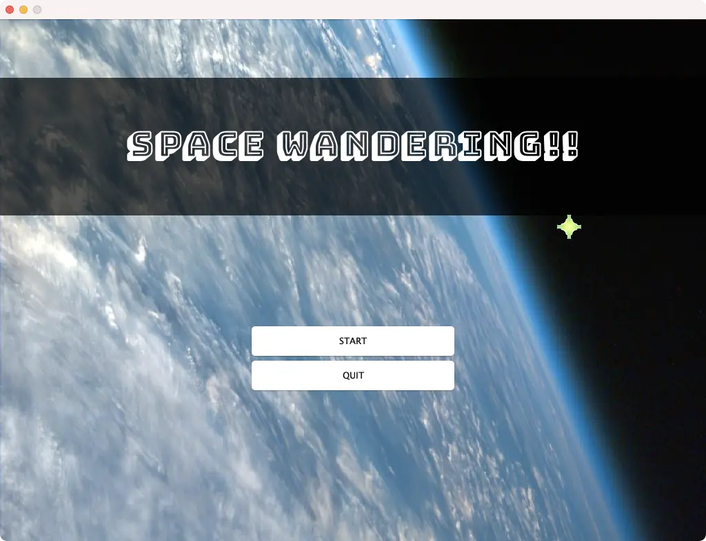
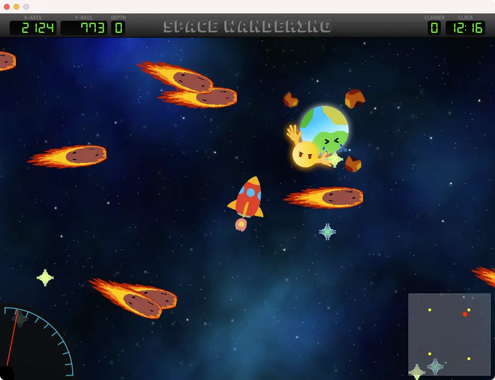
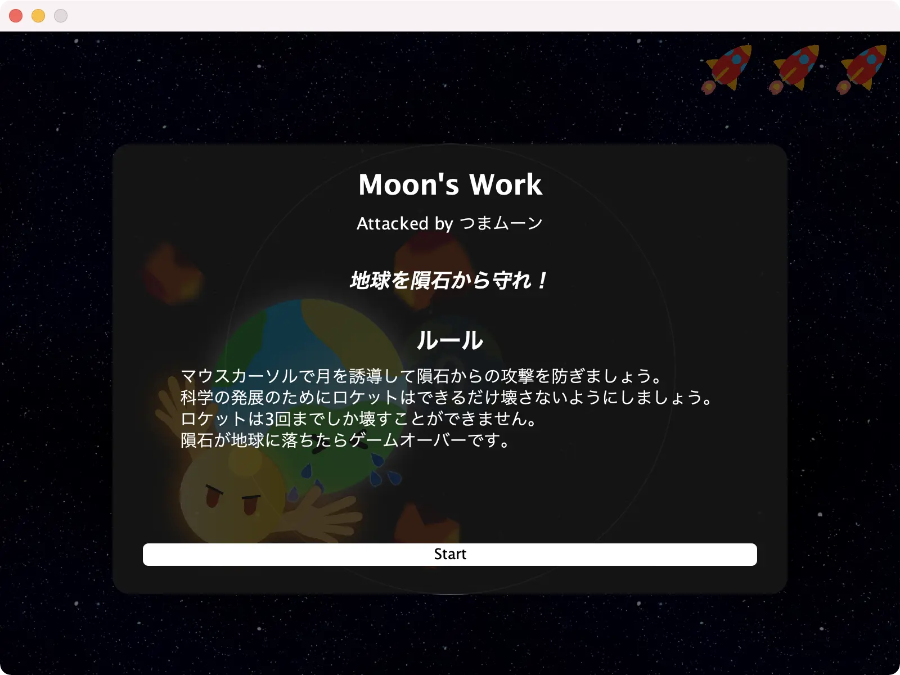
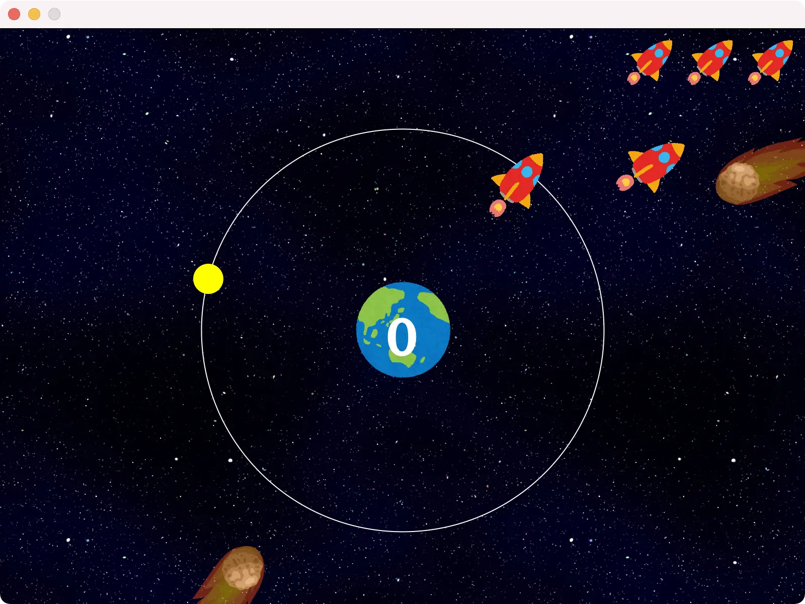
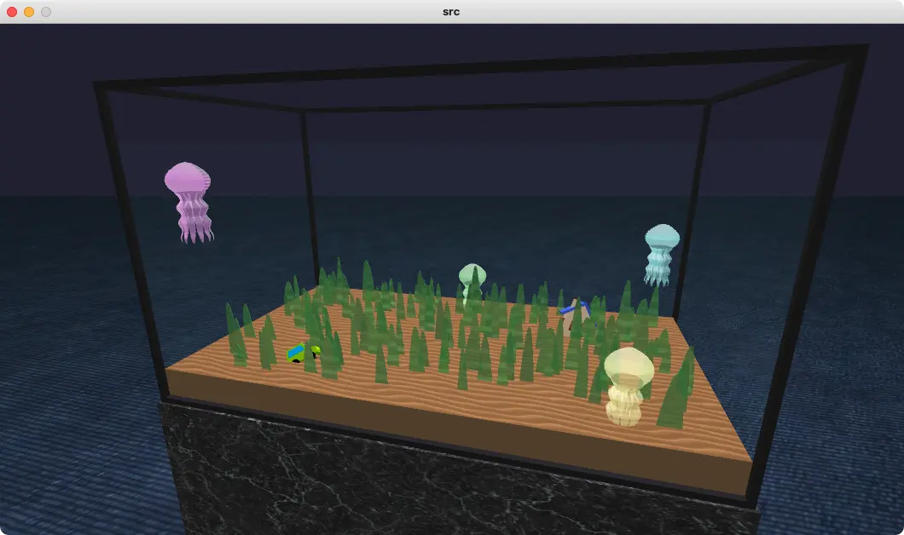
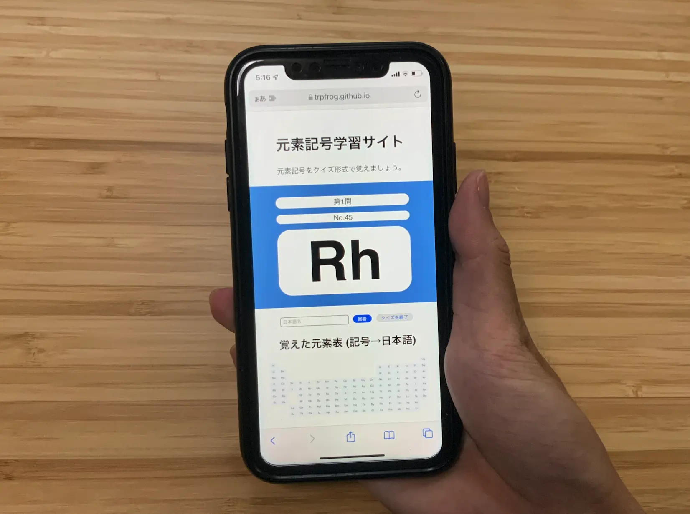

# 授業で作ったやつまとめ (2021)

**2019年版のまとめがあるんだから2021年版もまとめてみるぞ！**

ちなみに2020年は何もなかった

## Space Wandering

    
    

    
    

まあ今年といえば今年なので……

メディア情報学プログラミング演習？とかで作ったJava製のゲーム。開発 つまみ + [ちくわぶ](https://twitter.com/chikuwabu_uec) + [淵野アタリ](https://twitter.com/ebioishii_u) & 音楽 [ねぎ一世](https://twitter.com/negiissei) でお送りしております。正直実装するのが大変すぎてゲームの面白さとかは一切考えてないおしまいすぎるやつなので、えー……うーん……ごめんなさい！><

**今期メディプロやるぞ！** というメディアの学生の方はこれを反面教師として激ヤバおもしろゲームを作ってください！**開発は計画的に！**(デスマーチでリアルに死にかけるので)

<a href="https://github.com/TrpFrog/medipro-game" class="linkButton">GitHub</a>
<a href="https://trpfrog.github.io/medipro-game/" class="linkButton">紹介サイト</a>

## Jellyfish Aquarium

ビジュアル情報処理の課題。他の課題に追われて時間なすぎてパッと錬成した謎プログラム。レイトレやっていないので評定は良でした。**まあそう**

というか**めっちゃくちゃ優秀なメディアの人々**がいっぱい受けてる授業だし、適当なものを提出すると痛い目に遭うということですな、かなし〜

<a href="https://github.com/TrpFrog/jellyfish-aquarium" class="linkButton">GitHub</a>

## 元素覚えるやつ

プログラミング言語実験のJavaScript課題で作ったやつ。**Cookieとか使って学習状況が保存できる。**デザインもシンプルだけど気に入っている。実験は秀をもらえました！**やったね** (これのおかげだけではないけど！)

<a href="https://github.com/TrpFrog/elements-learning" class="linkButton">GitHub</a>
<a href="https://trpfrog.github.io/elements-learning/" class="linkButton">元素記号学習サイト</a>

続きはまた半年後、さようなら

